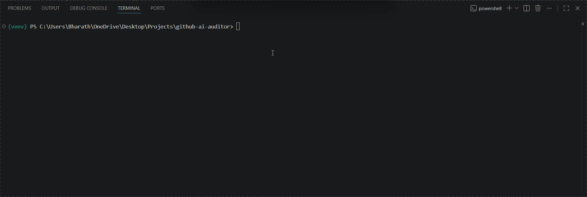

# GitHub AI Security Auditor

A CLI tool that scans GitHub repositories for **OWASP LLM Top 10** vulnerabilities
and AI/LLM security issues — hardcoded secrets, prompt injection, unsafe execution,
and insecure RAG implementations.



## Features

- Detects hardcoded API keys using regex + Shannon entropy analysis
- Flags prompt injection risks (LLM01) via static taint analysis
- Catches unsafe `eval()`/`exec()`/`subprocess` patterns (LLM07)
- Identifies unsafe RAG retrieval implementations (LLM01)
- Generates a security score (0–100) with OWASP LLM Top 10 mapping
- Exports full markdown reports
- Ships as a GitHub Action for CI/CD integration

## Installation

```bash
git clone https://github.com/spbharath21/github-ai-auditor
cd github-ai-auditor
pip install -e .
cp .env.example .env
# Add your GitHub token to .env
```

## Usage

```bash
# Scan any public repo
aiaudit scan --repo owner/repo

# Save a markdown report
aiaudit scan --repo owner/repo --output report.md
```

## OWASP LLM Top 10 Coverage

| ID    | Vulnerability                    | Detected By                                   |
| ----- | -------------------------------- | --------------------------------------------- |
| LLM01 | Prompt Injection                 | Prompt injection scanner + RAG safety scanner |
| LLM06 | Sensitive Information Disclosure | Secrets scanner                               |
| LLM07 | Insecure Plugin Design           | Unsafe execution scanner                      |

## How It Works

GitHub URL → fetcher.py → [secrets, unsafe_exec, prompt_injection, rag_safety]
→ aggregator → scoring engine → terminal report + markdown report

## Stack

Python · PyGithub · Rich · Jinja2 · Click · GitHub Actions
